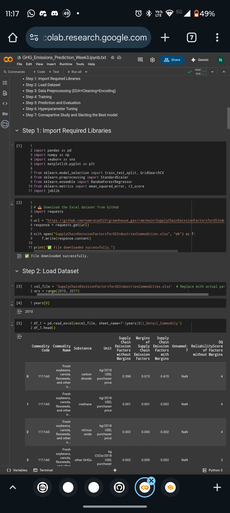
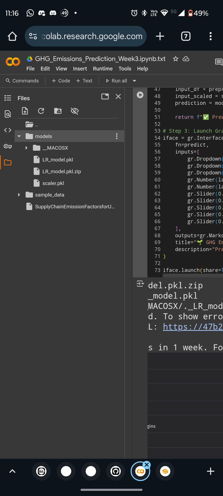
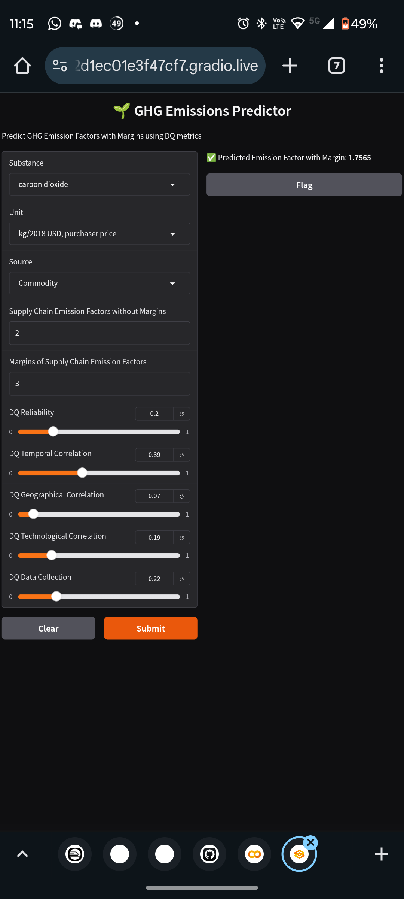

# 🌱 Greenhouse Gas Emission Prediction

This project analyzes and predicts **greenhouse gas (GHG) emissions** from U.S. industries and commodities using supply chain data published on [data.gov](https://catalog.data.gov/dataset/supply-chain-greenhouse-gas-emission-factors-for-us-industries-and-commodities).

---

## 📁 Dataset Source

- **Title:** Supply Chain Emission Factors for US Industries and Commodities  
- **Format:** Excel (.xlsx)  
- **Years Covered:** 2010–2016  
- **Source:** [Data.gov GHG Emission Factors](https://catalog.data.gov/dataset/supply-chain-greenhouse-gas-emission-factors-for-us-industries-and-commodities)

---

## 🖼️ Project Visuals

### 📊 EDA Overview


### 🤖 Model Training Snapshot


### 🚀 Gradio App Interface


---

## 🔧 Tools & Libraries Used

- Python
- Pandas
- Scikit-learn
- Matplotlib, Seaborn (for visualization)
- Gradio (for web deployment)
- Joblib (for model serialization)

---

## 🎯 Project Objectives

- ✅ Download and clean GHG emission factor data (commodities + industries)
- ✅ Perform exploratory data analysis (EDA)
- ✅ Engineer features including DQ metrics and emission margins
- ✅ Build regression models to predict:
  - Emission factors **with** margins
  - Based on **DQ metrics** and supply chain parameters
- ✅ Evaluate models using:
  - RMSE
  - MAE
  - R²
- ✅ Deploy an interactive app using **Gradio** in Google Colab

---

## 📅 Weekly Progress

### ✅ Week 1: Data Collection & Cleaning
- Downloaded and explored datasets
- Merged commodity and industry datasets
- Cleaned missing values, renamed columns, selected relevant features

### ✅ Week 2: Model Building
- Engineered new features: margin, reliability, correlation metrics
- Built Linear Regression model
- Evaluated model performance:
  - Metrics: RMSE, MAE, R²
- Saved model and scaler using `joblib`
- ✅ Model files:
  - [`LR_model.pkl`](models/LR_model.pkl)
  - [`scaler.pkl`](models/scaler.pkl)

### ✅ Week 3: Web Deployment
- Developed a user-friendly Gradio app
- Inputs include:
  - Substance type
  - Emission unit
  - Supply chain DQ metrics
- App outputs predicted **GHG emission factor with margin**
- Gradio interface hosted from Google Colab with public share link
- `app.py` created for deployment on platforms like:
  - Render
  - Hugging Face Spaces
  - Localhost

---

## 📲 Run the App

### ▶️ In Google Colab:
```python
!pip install gradio joblib pandas
